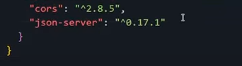

[spanish](https://github.com/SofiDevO/alurageek-API/tree/spanish)

## Deploy JSON Server to Vercel

A template for deploying [JSON Server](https://github.com/typicode/json-server) on [Vercel](https://vercel.com), allowing you to run a fake REST API online 🐣!

Demo from this repository: 
https://alurageek-api.vercel.app/
### How to use (resume)

1. Click "**Use this template**" or clone this repository.
2. Update or use the default [`db.json`](./db.json) in the repository.
3. Sign up or log in to [Vercel](https://vercel.com).
4. From the Vercel dashboard, click "**+ New Project**" and then "**Import**" your repository.
5. On the "**Configure Project**" screen, leave everything as default and click "**Deploy**".
6. Wait until deployment is complete, and your custom JSON server will be ready to serve!

## Default `db.json`

```json
{
 "product": [
        {
            "img": "https://www.claroshop.com/c/star-wars-day/img/categorias/TAZAS_CATEGORIAS_STAR_WARS.png",
            "name": "Trooper mug",
            "price": "$60.00",
            "description": "Trooper helmet mug",
            "category": "starwars",
            "id": 1
        },
        {
            "img": "https://cdn1.coppel.com/images/catalog/mkp/1773/5000/17733590-1.jpg",
            "name": "Vader Funko",
            "price": "$60.00",
            "description": "Collectible Funko of Darth Vader",
            "category": "starwars",
            "id": 2
        }
 ]
}
```

## Build It Yourself

If you'd like to create the project from scratch, I have a [YouTube video Tutorial (Spanish) that guides you through deploying your own fake API with db-json and Vercel.](https://www.youtube.com/channel/UC36_js-krsAHAEAWpEDhHtw) 

### Step 1

Create a new repository, for example, **alurageek-API**. Then clone that empty repository.

### Step 2

You need to run the npm init command:
```
npm init -y
```

This will generate a **package.json**. Now, what you need to do is change these lines:

Change this line:
``` 
 "main": "index.js",
```

To this:

```
  "main": "api/server.js",
```

And this:

```
"test": "echo \"Error: no test specified\" && exit 1"
```

To this:

```
"start": "node api/server.js"
```

### Step 3

Now it's time to run the command:

```
npm install json-server cors
```



You'll see that both **cors** and ***json-server*** have been added to the package.json.

### Step 4

Run the command:
```
npm install json-server
```

Add the ***.gitignore*** file and add ***node_modules***.

### Step 5

Create a ***db.json*** file and add your own data.

Additionally, you'll need to add a new [Folder called ***api***](./api/)  and, inside it, this [**server.js**](./api/server.js) file:

```javascript
// See https://github.com/typicode/json-server#module
const jsonServer = require('json-server')
const server = jsonServer.create()
const router = jsonServer.router('db.json')
const middlewares = jsonServer.defaults()

server.use(middlewares)
// Add this before server.use(router)
server.use(jsonServer.rewriter({
    '/api/*': '/$1',
    '/product/:resource/:id/show': '/:resource/:id'
}))
server.use(router)
server.listen(3000, () => {
    console.log('JSON Server is running')
})

// Export the Server API
module.exports = server
```

### Step 6

Create a new file named [***vercel.json***](./vercel.json)

```json
{
  "functions": {
    "api/server.js": {
      "memory": 1024,
      "includeFiles": "db.json"
    }
  },
  "rewrites": [
    {
      "source": "/(.*)",
      "destination": "api/server.js"
    }
  ]
}
```

# Don't forget to commit & push your changes 🐣

Go to your Vercel account, connect a new project with your repository, and deploy it💙

## You must be patient

It could take a couple of minutes to finally work. ⏰🥹

